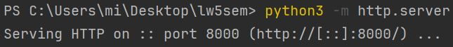
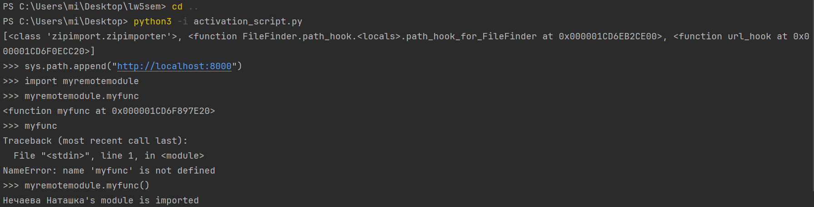
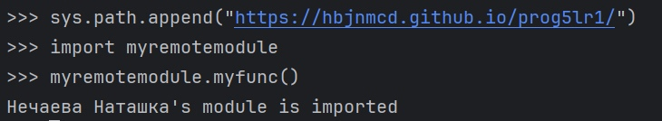

# Выполнение лабораторной работы №1
## В пятом семестре

1. Были созданы два файла - myremotemodule и activation_script. Они находятся в разных местах.
2. Запуск:
1. myremotemodule:


2. activation_script (у меня получилось не сразу):
  

3. Импорт модуля с сервера, [использован GitHub Pages](https://github.com/hbjnmcd/prog5lr1/tree/main). Результат на картинке.


   
4. Изменение класса URLLoader и функции url_hook с использованием модуля requests:

       ```python
            class URLLoader:
            ...
                def exec_module(self, module):
                    response0 = requests.get(module.__spec__.origin)
                    source = response0.text
            ...
            
            def url_hook(some_str):
            ...
                response1 = requests.get(some_str)
                data = response1.text
            ...
            ```
   
6. Для того, чтобы все сработало, сначала нужно было установить requests через pip install. Итог работы:
    

