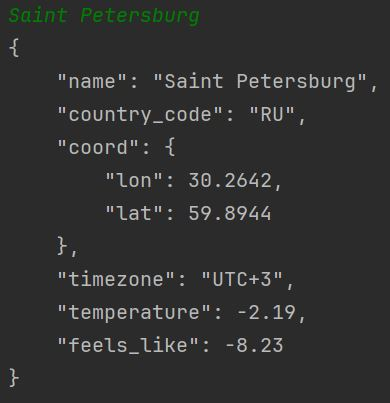

# Лабораторная работа №2

Реализована функция get_weather_data, а также функция format_utc_offset, которая реализует пересчет времени в формат UTC+-N

[Код можно посмотреть тут](https://github.com/hbjnmcd/prog5/blob/main/lr2/getweatherdata.py)

Результат работы:

