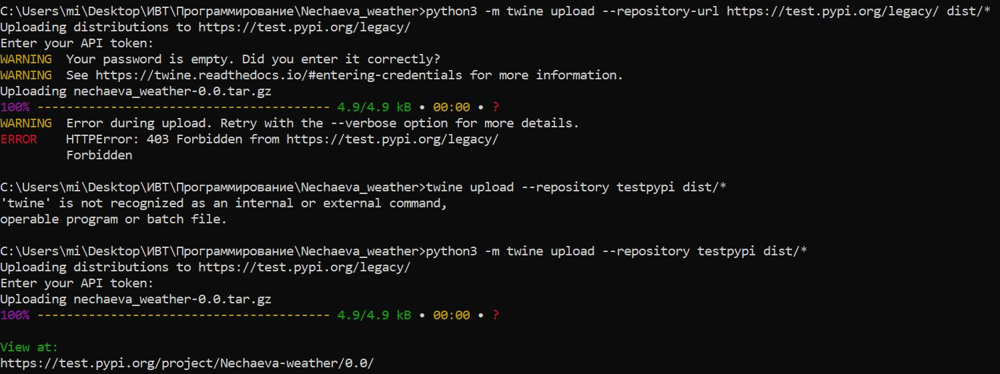

# Лабораторная работа №3
Цель работы: опубликовать свой созданный проект по просмотру погоды на PyPI

1. В командной строке были проделаны следующие действия:

2. По итогу [публикация](https://test.pypi.org/project/Nechaeva-weather/) в PyPI:

