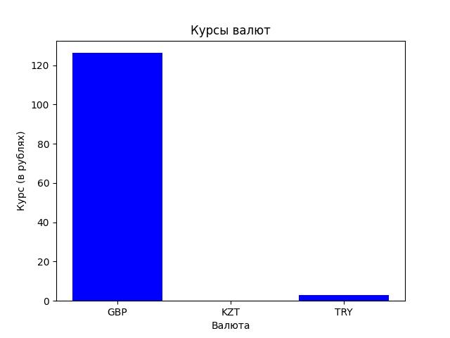
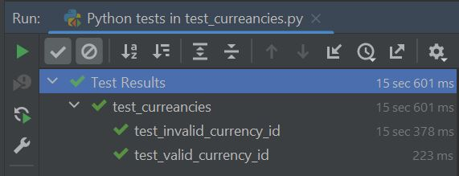

# Лабораторная работа #5
Цель работы: с использованием шаблона "Одиночка" реализовать получение данных с сайта ЦБ РФ, а также визуализировать их.

Был создан класс ```CurrencyFetcher```, наследующийся от класса ```SingletonMeta```. В этом классе осуществляется подключение к сайту ЦБ РФ, взятие данных с него, а также функция визуализации.



Также были написаны тесты, для проверки корректности работы написанного кода.


