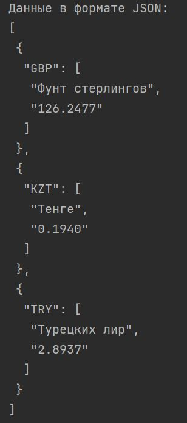
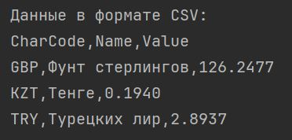

# Лабораторная работа №6
Цель работы: применить паттерн "декоратор" и реализовать объектно-ориентированную версию программы получения курсов валют с сайта ЦФ.

В качестве основы используется код, представленный в [__Лабораторной работе №5__](https://github.com/hbjnmcd/prog5/blob/main/lr5/main.py), а именно класс "CurrencyFetcher".
Было создано два декоратора, для вывода в JSON-формате и CSV (```ConcreteDecoratorJSON``` и ```ConcreteDecoratorCSV```; оба наследуются от класса ```CurrencyDecorator```. Данные о валютах получаются в классе ```CurrencyList```).



