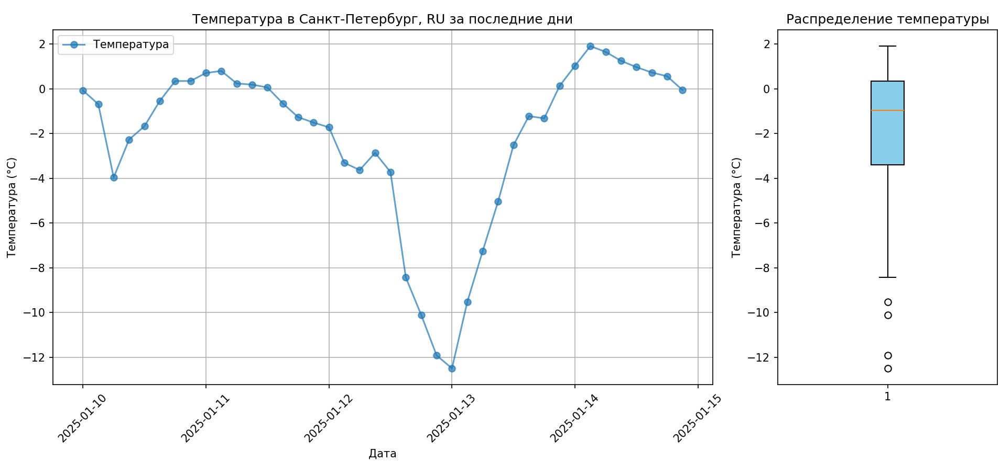

# Лабораторная работа №8
Цель работы: научиться обрабатывать и визуализировать данные, полученные с помощью API (на примере сервиса openweathermap).

Сначала данные о погоде получаются, затем формируются два графика, визуализирующие полученные данные:

Находятся эти данные в одном окне.
